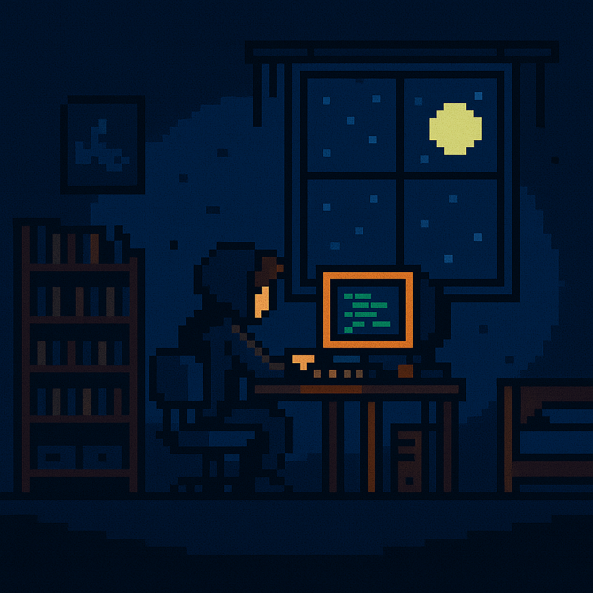

# 🎮 Retro Gaming Portfolio

> A unique portfolio website featuring a retro gaming theme, modern design principles, and interactive elements.



## ✨ Features

### 🎯 Core Features
- **Retro Gaming Theme** - Unique visual style with scanlines and CRT effects
- **Responsive Design** - Perfect display on all devices from mobile to desktop
- **Interactive UI** - Engaging animations and transitions
- **Dark Mode** - Eye-friendly design with retro aesthetics

### 📱 Key Sections
- **Hero Section** - Dynamic introduction with video background
- **About Me** - Professional profile with retro game-style stats
- **Skills** - Interactive skill showcase with progress bars
- **Projects** - Portfolio display with filterable categories
- **Contact** - Styled contact form with validation

## 🛠️ Technologies

### Frontend
- HTML5
- CSS3 (Custom animations & Grid layout)
- Vanilla JavaScript
- Font Awesome Icons
- Google Fonts (Press Start 2P)

### Effects & Animations
- Custom CSS animations
- Scanline effect
- CRT screen simulation
- Smooth scrolling
- Interactive hover states

## 🚀 Quick Start

### Prerequisites
- Modern web browser
- Text editor (VS Code recommended)
- Basic knowledge of HTML/CSS/JS

### Installation

1. Clone the repository
```bash
git clone https://github.com/Retro-Zero/retro-personal-portfolio.git
```

2. Navigate to project folder
```bash
cd retro-portfolio
```

3. Open index.html in your browser
```bash
# On Windows
start index.html

# On macOS
open index.html

# On Linux
xdg-open index.html
```

## 📁 Project Structure

```
retro-portfolio/
├── assets/                 # Images and media files
│   ├── hero.mp4           # Hero section background video
│   ├── hero.png           # Hero section fallback image
│   └── me.png             # Profile picture
│
├── css/
│   └── styles.css         # Main stylesheet
│
├── js/                    # JavaScript modules
│   ├── animation.js       # Animation controls
│   ├── navigation.js      # Navigation functionality
│   ├── theme.js          # Theme switching logic
│   └── typing.js         # Typing effect implementation
│
├── index.html            # Main HTML file
├── .gitignore           # Git ignore rules
├── LICENSE              # MIT license
└── README.md            # Project documentation
```

## 🎨 Customization

### Changing Colors
The color scheme is managed through CSS variables in `styles.css`:
```css
:root {
    --primary-purple: #6B2FB3;
    --primary-light: #9D67E6;
    --text-color: #FFFFFF;
    --overlay-color: rgba(0, 0, 0, 0.5);
}
```

### Adding Projects
1. Open `index.html`
2. Locate the projects section
3. Add your project using the existing card template
4. Update images and links accordingly

## 🤝 Contributing

1. Fork the repository
2. Create your feature branch
```bash
git checkout -b feature/AmazingFeature
```
3. Commit your changes
```bash
git commit -m 'Add some AmazingFeature'
```
4. Push to the branch
```bash
git push origin feature/AmazingFeature
```
5. Open a Pull Request

## 📝 License

This project is licensed under the MIT License - see the [LICENSE](LICENSE) file for details.

## 👤 Author

Retro-Zero
- GitHub: [@Retro-Zero](https://github.com/Retro-Zero)

## 🌟 Acknowledgments

- Inspiration from classic video games
- Font Awesome for icons
- Google Fonts for typography
- The open-source community

---
⭐️ If you like this project, give it a star!

Project Link: [https://github.com/Retro-Zero/retro-personal-portfolio](https://github.com/Retro-Zero/retro-personal-portfolio) 